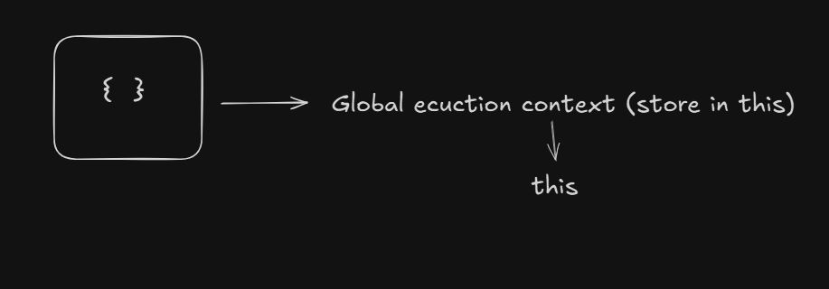
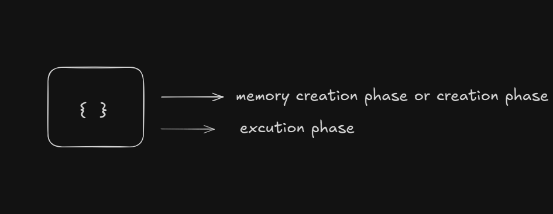
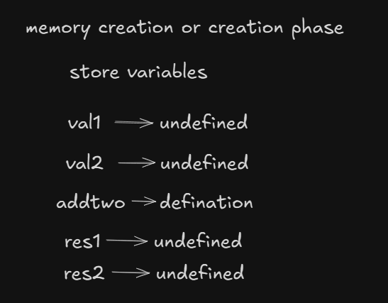
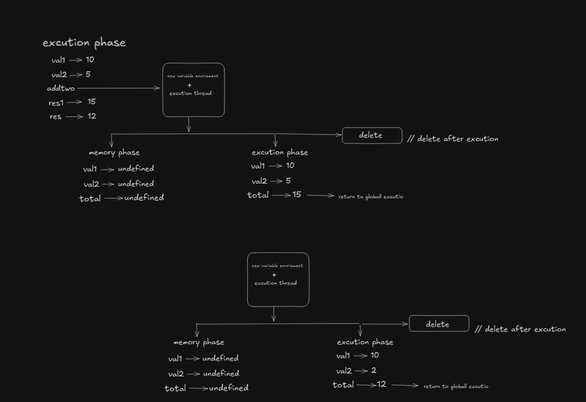
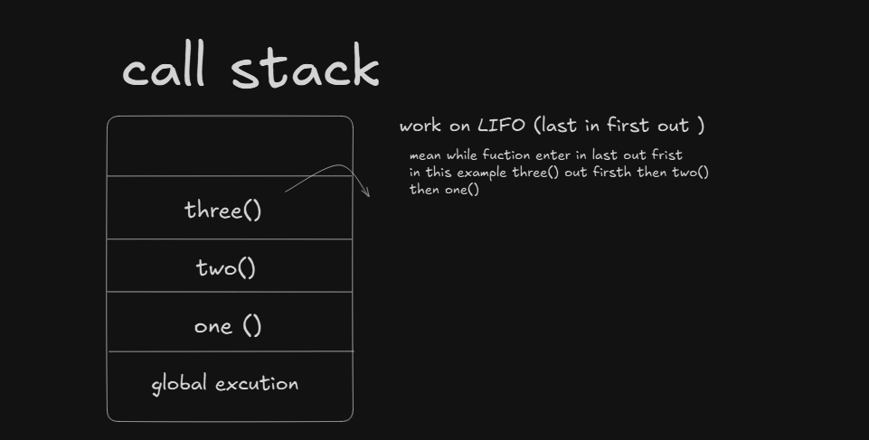
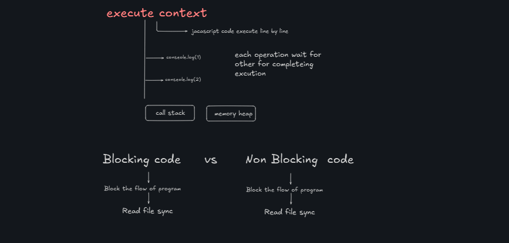
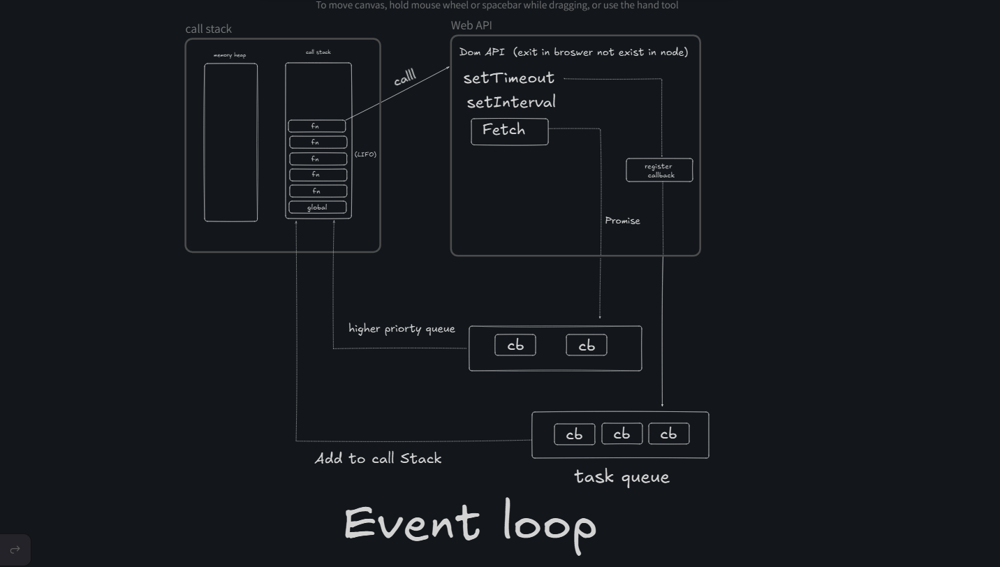
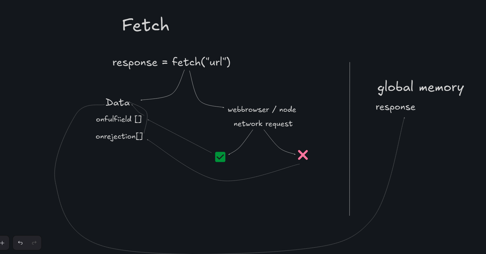

# Variables and Constants  

**`let`,`var`,and `const`**

 `let` is a keyword used to declare a variable that can be reassigned but is block-scoped. It is a **mutable** variable and has **local (block) scope**.  

```js
let score = 30;
```

  
`const` is used to declare a **constant**. It is **immutable**, meaning its value **cannot be changed** after assignment.  

```js
const score = 20;
```


`var` is a **global scope** variable. It is **not recommended** in modern JavaScript because of issues with block scope and function scope.  

```js
var score = 40;

/* Never use `var` due to scoping issues */
```

---

**Important Question**  
If we declare a variable without assigning a value, JavaScript **by default assigns `undefined`** to it.  

---

# **Datatypes and ECMAScript (ECMA)**  

**Strict Mode**  
```js
"use strict";
/*
Important:
Treats JS code as the latest version (modern JavaScript).
*/
```

### **Browser vs Node.js Environment**  
```js
alert("Hello, world!");
// Runs only in a browser environment, not in Node.js
```

---

## **Bad Practices**  
```js
console.log("Hello, world!"); console.log("How are you?");
/*
Never write code like this
because it reduces readability.
*/
```

---

## **Datatypes in JavaScript**  

```js
let name = "Aurpit"; // String
let age = 21; // Number
let isLogin = false; // Boolean
let arr = []; // Array
let obj = {}; // Object  

// Other special datatypes:
let emptyValue = null; // Null (a standalone empty value)
let notAssigned; // Undefined (value not assigned)
```

### **Notes on `typeof` Operator**  

```js
console.log(typeof null); // Output: "object"
console.log(typeof undefined); // Output: "undefined"

let score = 33;
console.log(typeof score); // Output: "number"
console.log(typeof(score)); // Output: "number"
```

*(`typeof null` being "object" is a known JavaScript quirk.)*

---

## **Datatype Conversion and Operations**  

### **`typeof` in JavaScript**  

*`typeof`: In JavaScript, `typeof` is used to check the type of a variable.*  

Example:  

```js
let score = 33;
console.log(typeof score); // Output: "number"
console.log(typeof(score)); // Output: "number"
```

---

### **Datatype Conversion in JavaScript**  

#### **1. Conversion to `Number`**  

```js
// Case 1
let score = "33";
console.log(typeof score); // Output: "string"
let valueInNum = Number(score);
console.log(valueInNum); // Output: 33

// Case 2
let score = "33abc";
console.log(typeof score); // Output: "string"
let valueInNum = Number(score);
console.log(valueInNum); // Output: NaN

// Case 3
let score = null;
console.log(typeof score); // Output: "object"
let valueInNum = Number(score);
console.log(valueInNum); // Output: 0

// Case 4
let score = undefined;
console.log(typeof score); // Output: "undefined"
let valueInNum = Number(score);
console.log(valueInNum); // Output: NaN

// Case 5
let score = true;
console.log(typeof score); // Output: "boolean"
let valueInNum = Number(score);
console.log(valueInNum); // Output: 1

// Case 6
let score = false;
console.log(typeof score); // Output: "boolean"
let valueInNum = Number(score);
console.log(valueInNum); // Output: 0
```

---

#### **2. Conversion to `Boolean`**  

```js
// Case 1
let isLogin = 1;
let booleanValue = Boolean(isLogin);
console.log(booleanValue); // Output: true

// Case 2
let isLogin = 0;
let booleanValue = Boolean(isLogin);
console.log(booleanValue); // Output: false

// Case 3
let isLogin = "";
let booleanValue = Boolean(isLogin);
console.log(booleanValue); // Output: false

// Case 4
let isLogin = "hi";
let booleanValue = Boolean(isLogin);
console.log(booleanValue); // Output: true
```

---

#### **3. Conversion to `String`**  

```js
//case 1
let num = 33;
let str = String(num);
console.log(str); // Output: "33"
console.log(typeof str); // Output: "string"
// Case 2
let boolValue = true;
let strBool = String(boolValue);
console.log(strBool); // Output: "true"
console.log(typeof strBool); // Output: "string"

// Case 3
let nullValue = null;
let strNull = String(nullValue);
console.log(strNull); // Output: "null"
console.log(typeof strNull); // Output: "string"
```


# Why String Conversion is Confusing in `JavaScript`

**Operations in `JavaScript`**

**Operations in `Numbers`**  


```js
let value = 3;
let negValue = -value;
console.log(negValue); // Output: -3

// Basic arithmetic operations
console.log(2 + 2);  // Output: 4
console.log(2 - 2);  // Output: 0
console.log(2 * 2);  // Output: 4
console.log(2 ** 2); // Output: 4
console.log(2 ** 3); // Output: 8
console.log(2 / 2);  // Output: 1
console.log(2 % 2);  // Output: 0
```

### Operations in `Strings`
```js
let str1 = "hellO";
let str2 = "aurpit";
let str3 = str1 + str2;
console.log(str1 + str2); // Output: helloaurpit
console.log("2" + 2); // Output: 22
console.log(1 + "2"); // Output: 12
console.log("2" + 2 + 2); // Output: 222
console.log(2 + 2 + "2"); // Output: 42
```
> **Note:** String concatenation can be tricky due to implicit type coercion.

### Operations in Boolean
```js
console.log(true);  // Output: true
console.log(+true); // Output: 1
console.log(+false); // Output: 0
```
> **Tip:** Avoid writing unreadable code like `+true` or `+false` as it reduces code clarity.

---

## `Prefix` and `Postfix` Operators in `JavaScript`
### Explanation
- **Prefix (`++var`)**: The variable is incremented **before** its value is used.
- **Postfix (`var++`)**: The variable is incremented **after** its value is used.

### Examples
#### Postfix Operator (`var++`)
```js
let score = 100;
console.log(score++); // Output: 100 (Returns value first, then increments)
console.log(score);   // Output: 101 (Now the value is incremented)
```
#### Prefix Operator (`++var`)
```js
let score = 100;
console.log(++score); // Output: 101 (Increments first, then returns value)
console.log(score);   // Output: 101
```

### Edge Cases
```js
let a = 5;
let b = a++ + ++a;
console.log(b); // Output: 12
```
**Breakdown:**
1. `a++` (Postfix) → Uses `5`, then increments `a` to `6`
2. `++a` (Prefix) → Increments `a` to `7`, then uses `7`
3. `b = 5 + 7 = 12`

---

### Best Practices
- Avoid complex expressions like `console.log((3 + 2) * 5 % 3);` for readability.
- Use parentheses to make operations clearer.
- Prefer explicit type conversion when dealing with numbers and strings.

```js
console.log(Number("2") + 2); // Output: 4 (Explicit conversion is clearer)
```

By following these practices, you can write cleaner and more maintainable JavaScript code.


## Comparison in `javascript`

```js
console.log(2>1)//output true
console.log(2>=1)//output true
console.log(2<1)//output false
console.log(2==1)//output false
console.log(2!=1)//output true
console.log("2">1)//output true
console.log("02">1)//output true
console.l0g(null>0)//output false
console.l0g(null==0)//output false
console.l0g(null>=0)//output true

/* 
the reason is that an equality check == and comparison > < >= <= work differently 
comparison convert null to a  number treating it as 0
that why (3) null >=0 is ture and (1) null >0 is false
console.log(undefined ==0 )  //output false
console.log(undefined>0) // output false
console.log(undefined<0) //output false
not prefered mostly  
*/

console.l0g(undefined>0)//output false
console.l0g(undefined==0)//output false
console.l0g(undefined>=0)//output false

/*=== strict check also check datatype 
console.log("2" ===2) //false*/
```
# Datatype Summary

## Types of Datatypes

### `Primitive` Datatypes
Primitive datatypes are stored in stack memory and hold copies of values.

- **String**
- **Number**
- **Boolean**
- **Null**
- **Undefined**
- **Symbol**
- **BigInt**

#### Example:
```js
// Primitive Datatypes
let name = "Aurpit"; // String
let age = 21; // Number
let isLogin = false; // Boolean
let address = null; // Null
let office = undefined; // Undefined
const id = Symbol("123"); // Symbol
const anotherId = Symbol("123"); // Symbol

console.log(id === anotherId); // false
```

### `Non-Primitive` Datatypes (Reference Types)
Non-primitive datatypes are stored in heap memory and hold references to values.

- **Array**
- **Object**
- **Function**

#### Example:
```js
// Non-Primitive Datatypes
let arr = [1, 2, 3, 4, 5, 6]; // Array
let obj = { name: "Aurpit", age: 12 }; // Object
let myFunc = function() { console.log("Hello World"); }; // Function
```

## `Stack` and `Heap` Memory

### `Stack` Memory
Stack memory is used for **primitive** datatypes, and it stores a copy of the value.

#### Example:
```js
// Stack Example
let myName = "Aurpit";
let myAnotherName = myName;

console.log(myAnotherName); // Aurpit

myAnotherName = "Hanu";
console.log(myAnotherName); // Hanu
console.log(myName); // Aurpit (unchanged)
```

### `Heap` Memory
Heap memory is used for **non-primitive** datatypes, and it stores a reference of the value.

#### Example:
```js
// Heap Example
let user = {
    name: "Aurpit",
    age: 21,
    email: "abc@gmail.com"
};

let user2 = user;
console.log(user2.email); // abc@gmail.com

user2.email = "123@gmail.com";
console.log(user.email); // 123@gmail.com
console.log(user2.email); // 123@gmail.com
```

In this case, `user2` references the same memory location as `user`, so changing `user2.email` also updates `user.email`.

# `Strings`

`Strings` in JavaScript can be defined using **single quotes ('')**, **double quotes ("")**, or the **String constructor**.

## Examples:
```js
// Defining a string
const name = "Aurpit";
const repos = 22;

// **Old Method (Concatenation)**
console.log(name + repos); // Output: Aurpit22

// **Modern Syntax (Template Literals - String Interpolation)**
console.log(`Hello, my name is ${name} and I have ${repos} repos on my GitHub.`); 
// Output: Hello, my name is Aurpit and I have 22 repos on my GitHub.

// Using String Constructor
const str = String('Aurpit');
console.log(str); // String {'Aurpit'}

// Accessing Characters
console.log(str[0]); // 'A'
console.log(str.toUpperCase()); // 'AURPIT'
console.log(str.charAt(2)); // 'r'
console.log(str.indexOf('t')); // 5

// Substring and Slice
console.log(str.substring(0, 4)); // 'Aurp'
const newStr = str.slice(-8, 4);
console.log(newStr); // 'Aurp'

// Trimming Whitespace
const str1 = "   Aurpit   ";
console.log(str1.trim()); // 'Aurpit'

// Replacing Characters
const url = "https://hitesh.com/hitesh%20choudary";
console.log(url.replace("%20", "-")); // 'https://hitesh.com/hitesh-choudary'

// Checking if a String Includes Another String
console.log(url.includes('hitesh')); // true

// Splitting a String
console.log(url.split("/")); // [ 'https:', '', 'hitesh.com', 'hitesh%20choudary' ]
```

# JavaScript `Numbers` and `Math`

## `Numbers`

### Definition
Numbers in JavaScript can be represented as primitive values or as objects of the `Number` class. JavaScript supports integers, floating-point numbers, and special values like `Infinity` and `NaN`.

```js
const score = 100;
console.log(score); // 100

// Another way to define a number object
const num = new Number(400);
console.log(num); // [Number: 400] (Node.js) or "Number {400}" (Browser)

console.log(num.toString()); // "400"
console.log(num.toString().length); // 3

console.log(num.toFixed(2)); // "400.00"

const anotherNum = 23.891;
console.log(anotherNum.toPrecision(3)); // "23.9"

const hundred = 1000000;
console.log(hundred.toLocaleString()); // "1,000,000"

console.log(Number.MAX_VALUE); // Largest possible number in JavaScript
```

## `Math` Operations

### Definition
The `Math` object in JavaScript provides built-in mathematical functions and constants for performing complex calculations.

```js
console.log(Math); // Object [Math] {}

console.log(Math.abs(-4)); // Returns the absolute value: 4
console.log(Math.round(4.3)); // Rounds to the nearest integer: 4
console.log(Math.ceil(4.2)); // Rounds up to the nearest integer: 5
console.log(Math.floor(4.3)); // Rounds down to the nearest integer: 4
console.log(Math.min(4, 3, 5, 7, 8)); // Returns the smallest value: 3
console.log(Math.max(4, 3, 5, 7, 8)); // Returns the largest value: 8

console.log(Math.random()); // Returns a random number between 0 and 1
console.log(Math.random() * 10 + 1); // Returns a random number between 1 and 10

// Generating a random number in a given range
const min = 10;
const max = 20;
console.log(Math.floor(Math.random() * (max - min + 1)) + min); // Random number between 10 and 20
```

# `Dates` in JavaScript

JavaScript `Date` is an object that represents a single moment in time in a platform-independent format. The `Date` object encapsulates an integral number representing milliseconds since midnight at the beginning of **January 1, 1970, UTC**.

## Creating `Date` Objects
```js
let date = new Date();
console.log(date); // Output: Current date and time
console.log(date.toString()); // Output: Full string representation
console.log(date.toDateString()); // Output: Date without time
console.log(typeof date); // Output: "object"
```

## Creating a Specific `Date`
```js
let myCreatedDate = new Date(2023, 0, 23); // Year, Month (0-based), Day
console.log(myCreatedDate.toDateString()); // Output: Mon Jan 23 2023
```

## Creating a Specific `Date` with `Time`
```js
let myCreatedDate1 = new Date(2023, 0, 23, 5, 55); // Year, Month, Day, Hour, Minute
console.log(myCreatedDate1.toString()); // Output: Mon Jan 23 2023 05:55:00 GMT+0000 (Coordinated Universal Time)
```

## `Timestamps`
```js
let myTimeStamp = Date.now();
console.log(myTimeStamp); // Output: Milliseconds since Jan 1, 1970
console.log(myCreatedDate.getTime()); // Output: Get time for specific date
console.log(Date.now() / 1000); // Output: Convert milliseconds to seconds
console.log(Math.floor(Date.now() / 1000)); // Output: Round down to seconds
```

## Extracting Date Parts
```js
let newDate = new Date();
console.log(newDate.getMonth()); // Output: Returns month (0-based)
```

## Formatting Dates
```js
console.log(newDate.toLocaleString('default', {
    weekday: "long"
})); // Output: Wednesday

console.log(newDate.toLocaleString('default', {
    year: "numeric",
    month: "long",
    day: "numeric"
})); // Output: March 27, 2025

console.log(newDate.toLocaleString('default', {
    hour: "2-digit",
    minute: "2-digit",
    second: "2-digit",
    hour12: true
})); // Output: 12:34:56 PM

console.log(newDate.toISOString()); // Output: 2025-03-27T12:34:56.000Z (ISO format)

console.log(newDate.toUTCString()); // Output: Wed, 27 Mar 2025 12:34:56 GMT (UTC format)
```

# JavaScript Arrays

JavaScript `Array` is resizable and can contain a mix of different data types. It makes a **shallow copy** when copied.

## Creating Arrays
```js
const myArr = [0, 1, 2, 3, 4, 5, 6];
console.log(myArr[0]); // 0

const myHeros = ["Shaktiman", "Nagaraj"];
const myArr2 = new Array(1, 2, 3, 4);
console.log(myArr2[1]); // 2
```

## Array Methods in JavaScript
```js
const myArr = [0, 1, 2, 3, 4, 5, 6];

myArr.push(7); // Adds element at the end: [0, 1, 2, 3, 4, 5, 6, 7]
myArr.pop(); // Removes last element: [0, 1, 2, 3, 4, 5, 6]

myArr.unshift(9); // Adds element at the beginning: [9, 0, 1, 2, 3, 4, 5, 6]
myArr.shift(); // Removes first element: [0, 1, 2, 3, 4, 5, 6]

console.log(myArr.includes(9)); // false (checks if element exists, returns boolean)
console.log(myArr.indexOf(19)); // -1 (returns -1 if element does not exist)
console.log(myArr.indexOf(2)); // 2 (returns index of element)

const newArr = myArr.join(); // Converts array to string
console.log(myArr); // [0, 1, 2, 3, 4, 5, 6]
console.log(newArr); // "0,1,2,3,4,5,6"
```

## `slice` vs `splice` in Arrays
```js
const myArr = [0, 1, 2, 3, 4, 5, 6];

// slice (returns new section, does not modify original array)
const myArr1 = myArr.slice(1, 3);
console.log(myArr1); // [1, 2]
console.log(myArr); // [0, 1, 2, 3, 4, 5, 6]

// splice (modifies original array, removes selected section)
const myArr2 = myArr.splice(1, 3);
console.log(myArr2); // [1, 2, 3]
console.log(myArr); // [0, 4, 5, 6]
```

## Joining Two Arrays
```js
const marvel_heros = ["Thor", "Ironman", "Spiderman"];
const dc_heros = ["Superman", "Flash", "Batman"];

marvel_heros.push(dc_heros);
console.log(marvel_heros); // ["Thor", "Ironman", "Spiderman", ["Superman", "Flash", "Batman"]]
console.log(marvel_heros[3][1]); // "Flash"

const all_heros = marvel_heros.concat(dc_heros);
console.log(all_heros); // ["Thor", "Ironman", "Spiderman", "Superman", "Flash", "Batman"]
```

## Joining Arrays Using Spread Operator
```js
const all_heros = [...marvel_heros, ...dc_heros];
console.log(all_heros); // ["Thor", "Ironman", "Spiderman", "Superman", "Flash", "Batman"]
```
This creates a **shallow copy** of `marvel_heros` and `dc_heros`.

## `flat` Method in JavaScript
The `flat()` method is used to flatten nested arrays.
```js
const another_array = [1, 2, 3, [4, 5, 6], 7, [6, 7, [4, 5, [8, 9, [10]]]]];
console.log(another_array.flat(1)); // Flattens one level
console.log(another_array.flat(2)); // Flattens two levels
console.log(another_array.flat(3)); // Flattens three levels
console.log(another_array.flat(Infinity)); // Fully flattens the array
```

## Other Array Methods
```js
console.log(Array.isArray("hitesh")); // false (checks if the value is an array)
console.log(Array.from("hitesh")); // ["h", "i", "t", "e", "s", "h"]
console.log(Array.from({ name: "hitesh" })); // [] (cannot directly convert objects to arrays)

// Converting object values to array
const obj = { name: "hitesh", age: 25 };
console.log(Object.values(obj)); // ["hitesh", 25]

let score1 = 100, score2 = 200, score3 = 300;
console.log(Array.of(score1, score2, score3)); // [100, 200, 300]
```

# JavaScript `Object`

## Singleton Object vs Object Literals
- **Singleton objects are created using the `Object` constructor.**  
- **Object literals are created using curly brackets `{}`.**

## Object Creation

```js
const mysym = Symbol("key1");

const obj = {
    [mysym]: "my key 1",
    name: "hitesh",
    location: "Jaipur",
    email: "hitesh@gmail.com",
    fullname: "Hitesh Choudary",
    isLogin: false,
};
console.log(obj);
/*
{
  name: 'hitesh',
  location: 'Jaipur',
  email: 'hitesh@gmail.com',
  fullname: 'Hitesh Choudary',
  isLogin: false,
  [Symbol(key1)]: 'my key 1'
}
*/
console.log(obj.email); // hitesh@gmail.com
// Another way to access properties
console.log(obj["email"]); // hitesh@gmail.com

// Accessing symbol key
console.log(obj[mysym]); // my key 1

Object.freeze(obj); // Freezing the object to prevent modifications
obj.email = "hitesh@yahoo.com"; // No effect due to freeze
console.log(obj);
```

## Creating Methods in an Object

```js
const obj = {
    [mysym]: "my key 1",
    name: "hitesh",
    location: "Jaipur",
    email: "hitesh@gmail.com",
    fullname: "Hitesh Choudary",
    isLogin: false,
};

obj.greeting = function() {
    console.log("Hello World");
};

console.log(obj.greeting); // [Function (anonymous)]
console.log(obj.greeting()); // Hello World undefined

// Since the function does not return anything, JavaScript implicitly returns `undefined`.
// If we return a string, this issue won't occur.

obj.greeting2 = function() {
   return "Hello World";
};
console.log(obj.greeting2()); // Hello World
```

## Creating an Object with a Constructor

```js
const tinder = new Object();
// const tinder = {}; // Both return an empty object
console.log(tinder); // {}

tinder.id = "123abc";
tinder.name = "Sam";
tinder.isLogin = false;
console.log(tinder);
/*
{ id: '123abc', name: 'Sam', isLogin: false }
*/
```

## Nested Objects and Optional Chaining

```js
const regularUser = {
    email: "some@gmail.com",
    username: {
        fullname: {
            firstName: "Hitesh",
            lastName: "Choudary"
        }
    }
};
console.log(regularUser);
/*
{
  email: 'some@gmail.com',
  username: { fullname: { firstName: 'Hitesh', lastName: 'Choudary' } }
}
*/
console.log(regularUser.username.fullname); // { firstName: 'Hitesh', lastName: 'Choudary' }
console.log(regularUser?.username?.fullname?.firstName); // Hitesh
console.log(regularUser?.username?.fullname?.middleName); // undefined
// Optional chaining returns undefined if the key does not exist
```

## Merging Objects

```js
const obj1 = { 1: "a", 2: "b" };
const obj2 = { 3: "a", 4: "b" };
const obj3 = { obj1, obj2 };
console.log(obj3);
/*
{ obj1: { '1': 'a', '2': 'b' }, obj2: { '3': 'a', '4': 'b' } }
*/

const obj4 = Object.assign({}, obj1, obj2);
console.log(obj4); // { '1': 'a', '2': 'b', '3': 'a', '4': 'b' }
console.log(obj1); // { '1': 'a', '2': 'b' }
```

## Merging Using the Spread Operator

```js
const obj1 = { 1: "a", 2: "b" };
const obj2 = { 3: "a", 4: "b" };
const obj3 = { ...obj1, ...obj2 };
console.log(obj3); // { '1': 'a', '2': 'b', '3': 'a', '4': 'b' }
```

## Objects Inside an Array

```js
const objArray = [{ id: "1", email: "b@gmail.com" }, { id: "2", 4: "a@gmail.com" }];
console.log(objArray[0].email); // b@gmail.com
```

## Other Useful Object Methods

```js
const objArray = [{ id: "1", email: "b@gmail.com" }, { id: "2", 4: "a@gmail.com" }];
console.log(Object.keys(objArray)); // [ '0', '1' ]
console.log(Object.values(objArray)); // [ { id: '1', email: 'b@gmail.com' }, { '4': 'a@gmail.com', id: '2' } ]
console.log(Object.entries(objArray));
/*
[
  [ '0', { id: '1', email: 'b@gmail.com' } ],
  [ '1', { '4': 'a@gmail.com', id: '2' } ]
]
*/
console.log(objArray[0].hasOwnProperty("id")); // true
```

## Object Destructuring and JSON

```js
const course = {
    courseName: "JavaScript",
    price: "999",
    courseTeacher: "Hitesh"
};
console.log(course.courseTeacher); // Hitesh

// Using destructuring
const { courseTeacher } = course;
console.log(courseTeacher); // Hitesh
const { courseTeacher: teacher } = course;
console.log(teacher); // Hitesh
```

### Destructuring in React

```js
const Navbar = ({ company }) => {
    console.log(company);
};
Navbar({ company: "Chai or Code" });
```

## JSON in JavaScript

```json
{
    "name": "Hitesh",
    "courseName": "JavaScript",
    "price": "Free"
}
```

- `JSON` is similar to an object but all **keys must be in strings**.
- `JSON` formatter tools help visualize and beautify `JSON` responses.
- Most APIs return responses in `JSON` format because it is **universally accepted**.
- `JSON` stands for **JavaScript Object Notation**.
- `JSON` can be accessed similarly to objects or arrays. Sometimes `JSON` responses contain arrays.


# Functions in JavaScript

**Functions are used to make sections of code reusable.**

```js
function sayMyName() {
    console.log("Hitesh Choudhary");
}

sayMyName(); // Hitesh Choudhary (Function execution)
sayMyName; // Function reference
```

## Argument and Parameter
```js
function addTwoNumbers(num1, num2) { // Parameters
    console.log(num1 + num2);
}

addTwoNumbers(3, 2); // Arguments 3, 2 -> Output: 5
```

## `return` in Function
```js
function addTwoNumbers(num1, num2) {
    console.log(num1 + num2);
}

const res = addTwoNumbers(3, 2); // Output: 5
console.log(res); // Undefined because we didn't return any value

function add(num1, num2) {
    let result = num1 + num2;
    return result;
    // or simply return num1 + num2;
}

const res1 = add(3, 5);
console.log(res1); // Output: 8
```

## String Interpolation in Function
```js
function loginMessage(username) {
    return `${username} just logged in`;
}

const res = loginMessage("Hitesh");
console.log(res); // Output: Hitesh just logged in
// If no argument is passed, it returns undefined
```

## Type Check in Function
```js
function loginUser(username) {
    if (username === undefined) {
        console.log("Please enter a username");
        return;
    }
    return `${username} just logged in`;
}

console.log(loginUser()); // Output: Please enter a username, undefined
console.log(loginUser("Hitesh")); // Output: Hitesh just logged in

// OR
function loginUser(username) {
    if (!username) { // ! converts truthy values to false and vice versa
        console.log("Please enter a username");
        return;
    }
    return `${username} just logged in`;
}

console.log(loginUser()); // Output: Please enter a username, undefined
console.log(loginUser("Hitesh")); // Output: Hitesh just logged in

// OR (Using Default Parameter)
function loginUser(username = "Sam") {
    return `${username} just logged in`;
}

console.log(loginUser()); // Output: Sam just logged in
```

## Rest Operator in JavaScript
```js
function calculateCartPrice(num) {
    return num;
}

console.log(calculateCartPrice(2)); // Output: 2

// If multiple values are passed
console.log(calculateCartPrice(2, 10, 12, 23)); // Output: 2 (returns the first value)

// Using Rest Operator
function calculateCartPrice(...num) {
    return num;
}

console.log(calculateCartPrice(2, 12, 23, 14)); // Output: [2, 12, 23, 14]

// OR
function calculateCartPrice(num1, num2, ...num) {
    return num;
}

console.log(calculateCartPrice(2, 12, 23, 14)); // Output: [23, 14]
```

## Object and Array as Arguments
```js
const user = {
    username: "Hitesh",
    price: 199
};

function handleObject(obj) {
    console.log(`Username is ${obj?.username} and price is ${obj?.price}`);
}

handleObject(user); // Output: Username is Hitesh and price is 199

// OR
handleObject({
    username: "Aurpit",
    price: 150
}); // Output: Username is Aurpit and price is 150

// Array
function returnSecondValue(arr) {
    console.log(arr[1]);
}

returnSecondValue([200, 300, 400, 500]); // Output: 300
```

# `Global Scope` and `Local Scope`
```js
let a = 10;
const b = 20;
var c = 30;

console.log(a); // 10
console.log(b); // 20
console.log(c); // 30

// OR
if (true) {
    let a = 10;
    const b = 20;
    var c = 30;
}

console.log(a); // ReferenceError: a is not defined
console.log(b); // ReferenceError: b is not defined
console.log(c); // 30

// {} (Curly Braces) define scope when used with functions and conditional statements

// Example with Global and Local Scope
var c = 300; // Global Scope
if (true) {
    let a = 10;
    const b = 20;
    var c = 30;
    console.log(a); // 10
    console.log(b); // 20
    console.log(c); // 30
    // Local Scope can access Global Scope variables, but Global Scope cannot access Local Scope variables
}

console.log(c); // Output: 30
```
## **Nested Scope in JavaScript**

```js
// Nested scope in function
function one() {
    const username = "hitesh";
    
    function two() {
        const website = "youtube";
        console.log(`username ${username} website ${website}`); // Output: username hitesh website youtube
    }
    
    two();
    
    console.log(website); // ❌ ReferenceError: website is not defined
    // The variable `website` is defined inside `two()` and is not accessible outside.
}

one();

// Nested scope in if-else
if (true) {
    const username = "hitesh";
    
    if (username === "hitesh") {
        const website = "youtube";
        console.log(`username ${username} website ${website}`); // Output: username hitesh website youtube
    }
    
    console.log(website); // ❌ ReferenceError: website is not defined
    // The variable `website` is scoped inside the inner `if` block.
}
```

---

## **Hoisting (Basic) in JavaScript**

```js
// declarations function
function addOne(num) {
    console.log(num + 1);
}

addOne(5); // ✅ Output: 6

// Function Expression
const addTwo = function (num) {
    console.log(num + 2);
};

addTwo(5); // ✅ Output: 7
```

### **Understanding Hoisting:**
```js
addOne(5); // ✅ Output: 6 - Function declarations are hoisted

function addOne(num) {
    console.log(num + 1);
}

addTwo(5); // ❌ ReferenceError: Cannot access 'addTwo' before initialization

const addTwo = function (num) {
    console.log(num + 2);
};
```

### **Explanation:**
1. **Function declarations** (`function addOne()`) are **hoisted** to the top, meaning they can be called before they are defined in the code.
2. **Function expressions** (`const addTwo = function()`) are **not hoisted** the same way. Since `addTwo` is declared as a `const` variable, it does not exist before its definition, leading to a **ReferenceError** if accessed before initialization.

```js
// Behind the scenes hoisting behavior:
// This happens internally:
function addOne(num) {
    console.log(num + 1);
}

// But this doesn't:
// const addTwo; (This variable exists but is in the 'temporal dead zone' before initialization)
```

# `this` and Arrow Functions in JavaScript

## `this` in Regular Functions

```js
const user = {
    username: "hitesh",
    price: 999,
    welcomemsg: function () {
        console.log(`${this.username} welcome to website`);
        console.log(this);
    }
};

user.welcomemsg(); // hitesh welcome to website
user.username = "sam";
user.welcomemsg(); // sam welcome to website

console.log(this); // {} in Node.js, `window` in browsers (undefined in strict mode)
```

### `this` in Regular Function Calls
```js
function chai() {
    let username = "hitesh";
    console.log(this.username); // undefined
    console.log(this); // `global` in Node.js, `window` in browsers (undefined in strict mode)
}
chai();
```

### `this` in Function Expressions
```js
const chai = function () {
    let username = "hitesh";
    console.log(this.username); // undefined
    console.log(this); // `global` in Node.js, `window` in browsers (undefined in strict mode)
};
chai();
```

## `this` in Arrow Functions

```js
const chai = () => {
    let username = "hitesh";
    console.log(this.username); // TypeError: Cannot read properties of undefined
    console.log(this); // `{}` in Node.js (undefined in strict mode)
};
chai();
```

### Arrow Functions and Implicit Returns
```js
const addTwo = (n1, n2) => {
    return n1 + n2;
};
console.log(addTwo(2, 3)); // 5

// Implicit return
const addTwoShort = (n1, n2) => n1 + n2;
console.log(addTwoShort(2, 3)); // 5

// Parentheses for object return
const getUser = () => ({ username: "hitesh" });
console.log(getUser()); // { username: 'hitesh' }
```

## Immediately Invoked Function Expressions (IIFE)

To prevent global scope pollution, we use IIFE.

```js
// Function Definition & Execution
;(function () {
    console.log("Hello world");
})(); // Hello world

// Named IIFE
;(function chai() {
    console.log("Hello world");
})(); // Hello world

// Arrow Function IIFE
;(() => {
    console.log("Hello world");
})(); // Hello world

/* Use `;` before IIFE to avoid errors if previous statements don't end with `;`. */

((name)=>{
      console.log(` db conected to ${name}`)
  })("hitesh")// db conected to hitesh
  
```

## Summary
- `this` behaves differently in regular vs arrow functions.
- Arrow functions do not bind `this` to an object, inheriting it from their lexical scope.
- IIFE helps prevent global scope pollution.


# Execution Context and Call Stack


**JavaScript Execution Context**  

### types of Execution Context:  
- Global Execution Context  
- Function Execution Context  
- Eval Execution Context  

  

**Global Execution Context is stored in this.**  



then start creation phase or excution phase

**Example of exuction context**

```js
let val1=10
let val2=5
function addnum (num1,num2){
    let total =num1 +num2
    return total
}
let res1=addnum(val1,val2)
let res2=addnum(10,2)
```
1 global excution 

  

2 memory creation phase  



first cycle complete   

3 excution phase  




second cycle end

## call stack
The Call Stack keeps track of function execution in JavaScript.Each function call is added to the stack and removed once execution is complete.

When `addNum(val1, val2) `is called, it is pushed onto the call stack.

When `addNum(10, 2)` is called, it is also pushed onto the stack.

Once a function returns a value, it is popped from the stack.

```js
function one (){
    console.log("one")
    two()
}
function two (){
    console.log("two")
    three()
}
function three (){
    console.log("three")
}
one()
```



we can see this call stack in windows inspect under source
go to soruce tab then click not snippet under this we can see this call stack


# control flow in javascript 

**if statement** : if the conditon true then code excute other wise not   

```js 
// syntex of if statement
if (true ){
    console.log(`code execute`)
}

if(2==2){
    console.log(`code execute`)
}

const userLoggedIn=true
if(userLoggedIn){
    console.log(`code excute`)
}

```
conditions <,>,<=,>=,==,===  
e.g 
```js
2<=2  //true
3!=2 //true
if(3!=2) {
    console.log(`code executed`)
}
if(2=="2"){
    console.log("executed")// code ececuted
}

if(2==="2"){
       console.log("executed")
 
}

```

**if else statement**
```js
const temp=41
   // conditional code
   if(temp){
      console.log("temp less than 50")//temp less than 50
   }
   else {
      console.log("temp more than 50")
   }

    const score=200
   // conditional code
   if(score>100){
      const power="fly"
      console.log(`power :${power}`)//power :fly
   }
   console.log(`user power :${power}`)//ReferenceError: power is not defined

```
**if else if Statement**
```js
const balance =1000
// explicit scope 
   if(balance)console.log(`test`)// test // good practice ,short hand

   if(balance) console.log("test"),console.log('test1') 
//test 
//test1 
/*not a good practice*/

const balance =1000
 
   if(balance<300){
      console.log(`balance is less then 300`)
   }
   else if(balance<750){
      console.log(`balance is less then 750`)

   }
   else if (balance<900){
      console.log(`balance is less then 900`)

   }
   else{
      console.log(`balance is less then 1200`) //balance is less then 1200

   }
  
```

**&& or ||**
```js
 const userloggedIn=true 
   const debitcard=true
   if(userloggedIn&&debitcard){
      console.log('allow to by course')//allow to by course
   }

    const loginfromgoogle =false
   const loginfromemail=true 
   if(loginfromgoogle||loginfromemail){
      console.log('user login')//user login
   }
```

**switch case**
```js
const month =3 || "mar"
  switch (month) {
   case 1:
      console.log("jan")
      break;

   case 2:
      console.log("feb")
      break;
  
   case 3:
      console.log("mar")
      break;
  
   case 4:
      console.log("april")
      break;
  
   case 5:
      console.log("may")
      break;
  
   case 6:
      console.log("june")
      break;
  
   default:
      console.log("month not match")
      break;
  }

  //mar

  switch (month) {
   case "jan":
      console.log("jan")
      break;

   case "feb":
      console.log("feb")
      break;
  
   case "mar":
      console.log("mar")
      break;
  
   case "april":
      console.log("april")
      break;
  
   case "may":
      console.log("may")
      break;
  
   case "june":
      console.log("june")
      break;
  
   default:
      console.log("month not match")
      break;
  }
//mar
```
**important for interview prosepective**
```js
  const useremail={}||[]||"h@Hiteshai"
if(useremail){
   console.log("got email")
}
else{
   console.log('dont have email')
}
// got email

if(useremail){
   console.log("got email")
}
else{
   console.log('dont have email')
}

// got email
if(useremail){
   console.log("got email")
}
else{
   console.log('dont have email')
}
//got email

// fasley value 
// false,0,-0,BigInt 0n ,null ,undefiend,NaN
//Truthy value
//true ,"string","0","false","  ",[],{ }, function (){},"null" ,"undefined"

// if useremail is array
const emptyarr=[]
   if(emptyarr.length===0){
      console.log("array is empty")
   }
   //array is empty
   const emptyobj={}
   if(Object.keys(emptyobj)){
      console.log(`object is empty`)
   }
   //object is empty

   /*
   false ==0 true 
   false =="" true 
   0 === "" true
   */
```
**nullish coalescing operator (??) ; used for null & undefined 

```js
  let val1 
val1 =5 ??10
console.log(val1)//5

val1=null ??10
console.log(val1)//10

val1=undefined??15
console.log(val1)//15

val1=null??10??15
console.log(val1)//10
```
**terinary operator**
```js
// condition ?true :false
   const iceteaprice=100
iceteaprice<=80?console.log("less than 80"):console.log("more than 80")
// more than 80
```

# for loop and break and countinue
```js
for (let i = 0; i < 10; i++) {
   const element = i
   console.log(i)
   
}
/*
0
1
2
3
4
5
6
7
8
9
*/

```
```js
for (let i = 0; i <3; i++) {
   console.log(` outer loop ${i}`)
  for (let i = 0; i < 3; i++) {
console.log(`inner loop ${i}`)   
   
  }
   
}
/*
 outer loop 0
inner loop 0
inner loop 1
inner loop 2
 outer loop 1
inner loop 0
inner loop 1
inner loop 2
 outer loop 2
inner loop 0
inner loop 1
inner loop 2
*/
```
```js
for (let i = 1; i <=3; i++) {
   console.log(` table of  ${i}`)
  for (let j= 0; j <=10; j++) {
console.log(`${i} * ${j} = ${i*j}`)   
   
  }
   
}
/*  table of  1
1 * 0 = 0
1 * 1 = 1
1 * 2 = 2
1 * 3 = 3
1 * 4 = 4
1 * 5 = 5
1 * 6 = 6
1 * 7 = 7
1 * 8 = 8
1 * 9 = 9
1 * 10 = 10
 table of  2
2 * 0 = 0
2 * 1 = 2
2 * 2 = 4
2 * 3 = 6
2 * 4 = 8
2 * 5 = 10
2 * 6 = 12
2 * 7 = 14
2 * 8 = 16
2 * 9 = 18
2 * 10 = 20
 table of  3
3 * 0 = 0
3 * 1 = 3
3 * 2 = 6
3 * 3 = 9
3 * 4 = 12
3 * 5 = 15
3 * 6 = 18
3 * 7 = 21
3 * 8 = 24
3 * 9 = 27
3 * 10 = 30`
*/
```
**iterate array with for loop**
```js
let arr= ["flash","superman","batman"]
for (let i = 0; i < arr.length; i++) {
  const element = arr[i];
  console.log(element)
  
}
/*

flash
superman
batman
*/
```
**break & continue in for loop**
```js
// break stop the iteration or loop when condition match
for (let i = 0; i <=10; i++) {
  
  if(i==5){
    console.log("detected 5")
    break
  }
  console.log(i)
}
/*
0
1
2
3
4
detected 5
*/

// continue skip the iteration  when condition match

for (let i = 0; i <=10; i++) {
  
  if(i==5){
    console.log("detected 5")
    continue
  }
  console.log(i)
}

/*0
1
2
3
4
detected 5
6
7
8
9
10*/
```
# do while loop or while loop
```js
// syntax
//code write in this scope excute when condtion true
while (condition) { 

// code here
  
}

let i=0
while (i<=10) {
   console.log(`value of  i is ${i}`) 
   i+=2
   
}
/*
value of  i is 0
value of  i is 2
value of  i is 4
value of  i is 6
value of  i is 8
value of  i is 10
*/

let arr=["flash","superman","batman"]
let i=0
while(i<arr.length){
   console.log(`value of arr is ${arr[i]}`)
   i++
}
/*
value of arr is flash
value of arr is superman
value of arr is batman
*/
```
```js
// run at least one time and then repeadly excute  it as long as the condition is true
do {
   
} while (condition);

let score =1
do {
   
   console.log(`score :${score}`)
   score++
} while (score<=10);
/*
score :1
score :2
score :3
score :4
score :5
score :6
score :7
score :8
score :9
score :10
*/

let score =11
do {
   
   console.log(`score :${score}`)
   score++
} while (score<=10);
/*
score :11
*/
```

# Higher order array loop

**for of loop**
```js

const arr=[1,2,3,4,5,6,7,8]
for (const i of arr) {
   console.log(i)
   
}
/**
1
2
3
4
5
6
7
8
  
 */

const greetings='hello world!'
for (const greet of greetings) {
   console.log(greet)
}
/*
h
e
l
l
o
 
w
o
r
l
d
! */

```

**Map in javascript**

```js
// map has unique values
 const map =new Map()
   map.set("in",'india')
   map.set("us",'united state ')
   map.set("in",'india')
console.log(map)//Map(2) { 'in' => 'india', 'us' => 'united state ' }

for (const i of map) {
   console.log(i)
   //[ 'in', 'india' ]
 //  [ 'us', 'united state ' ]
   
}

for (const [key,value] of map) {
   console.log(`${key}:${value}`)
   //in:india
   //us:united state
}

```
**For in loop**

```js
// we cant iterate object with for of loop

for (const key of myobject) {
   console.log(key)//myobject is not iterable
   
}

// we use for in loop to iterate objects
const myobject={
   'game1':"NFS",
   'game2':"spiderman"
}
  
for (const key in myobject) {

   console.log(key)
   // iterate key of object 
  //game1
 //game2
}

for (const key in myobject) {
   
   console.log(`${key} :${myobject[key]}`)
   // to iterate key and values 
   // game1 :NFS
//   game2 :spiderman
}

// for in loop in arr

const programing=["js","py","cpp","c","java","rb"]

for (const key in programing) {
   // iterate key of arr
  console.log(`keys`,key)
//   keys 0
// keys 1
// keys 2
// keys 3
// keys 4
// keys 5
}

for (const key in programing) {
   // iterate value of arr
   console.log(programing[key])
//    js
// py
// cpp
// c
// java
// rb
}
```

**forEach loop**
```js
const coding=["js","ruby","java","python","cpp"]

coding.forEach(function(item){
   console.log(item)
   //    js
// ruby
// java
// python
// cpp
})

coding.forEach((item)=>{
   console.log(item)
//    js
// ruby
// java
// python
// cpp
})
function printme(item){
   console.log(item)

}
coding.forEach(printme) 
// js
// ruby
// java
// python
// cpp

const coding=["js","ruby","java","python","cpp"]
coding.forEach((item,index,ar)=>{
   console.log(item,index,ar)
   /**
 js 0 [ 'js', 'ruby', 'java', 'python', 'cpp' ]
ruby 1 [ 'js', 'ruby', 'java', 'python', 'cpp' ]
java 2 [ 'js', 'ruby', 'java', 'python', 'cpp' ]
python 3 [ 'js', 'ruby', 'java', 'python', 'cpp' ]
cpp 4 [ 'js', 'ruby', 'java', 'python', 'cpp' ] 
*/

})


const mycoding=[
   {
      langName:"js"
   },
   {
      langName:"python"
   },
   {
      langName:"cpp"
   }
]

mycoding.forEach((item)=>{
   console.log(item)
   //{ langName: 'js' }
// { langName: 'python' }
// { langName: 'cpp' }
})
```

# Filter ,map ,reduce in array

**Why do we need `filter`, `map`, and `reduce` if we already have forEach?**

*Because `forEach` iterates over an array but does not return a value.In some cases, we need a modified array, so we use map or filter instead.*

```js
   const coding=["js","ruby","java","python","cpp"]
const value=coding.forEach((item)=>{
    console.log(item)
    /**
     * js
    ruby
    java
    python
    cpp
     */
    return item
}
)
console.log(value)//undefined
```

**filter in array**

*`filter` is used to create a new array by filtering elements from the original array 
 based on a given condition. It does not modify the original array.*
```js
 const mynum=[1, 2, 3, 4, 5, 6, 7, 8, 9, 10];

   const newnum = mynum.filter(num=> num > 5);
   console.log(newnum)//[ 6, 7, 8, 9, 10 ]

   
    const newnum2 = mynum.filter((num)=> {num < 5}); 
    // This will not work as expected because the arrow function does not return a value.
    console.log(newnum2)

 const newnum2 = mynum.filter((num)=> { return num < 5});
    console.log(newnum2)//[ 1, 2, 3, 4 ]

    // we aslo do this with forEach but with some additional step because forEach don't return any value

    const mynum=[1, 2, 3, 4, 5, 6, 7, 8, 9, 10];
   
   const output=[]

   mynum.forEach((num)=>{

    if(num%2==0){

        output.push(num)

    }
   })

   
console.log(output)//[ 2, 4, 6, 8, 10 ]
  const books = [
    {
      title: "The Pragmatic Programmer",
      author: "Andrew Hunt, David Thomas",
      publisher: "Addison-Wesley",
      edition: "2nd"
    },
    {
      title: "Clean Code",
      author: "Robert C. Martin",
      publisher: "Prentice Hall",
      edition: "1st"
    },
    {
      title: "You Don't Know JS",
      author: "Kyle Simpson",
      publisher: "O'Reilly Media",
      edition: "1st"
    },
    {
      title: "Eloquent JavaScript",
      author: "Marijn Haverbeke",
      publisher: "No Starch Press",
      edition: "3rd"
    }
  ];

  const filterbk=books.filter(bk=>{
    return bk.edition==="1st"
  })

  console.log(filterbk)
  /**
```

**map in array**  
 *`map` is used to create a new array by applying a function to each element of the original array.
It does not modify the original array but returns a new array with transformed values*

```js 
  const mynum=[1, 2, 3, 4, 5, 6, 7, 8, 9, 10];
   
   //map with explicit return
   const newnum= mynum.map(num=>num+10)
   console.log(newnum)/*[
    11, 12, 13, 14, 15,
    16, 17, 18, 19, 20
  ]*/


 //map with scope without return keyword
   const newnum= mynum.map(num=>{num+10})
   console.log(newnum)
   /**
    [
  undefined, undefined,
  undefined, undefined,
  undefined, undefined,
  undefined, undefined,
  undefined, undefined
]
    */

    
 //map with scope and return keyword
   const newnum= mynum.map(num=>{return num+10})
   console.log(newnum)
   /**
   [
  11, 12, 13, 14, 15,
  16, 17, 18, 19, 20
]
    */

    // chaning in js 
  const newnum=mynum.map(num=>num*10)
        .map(num=>num+1)
        .filter(num=>num >50)  
     
console.log(newnum)//[ 51, 61, 71, 81, 91, 101 ]


```

**reduce in js**  
*`reduce` is used to iterate over an array and accumulate a single value based on a callback function.
It takes an initial value and applies the callback function to each element, updating the accumulator.*

```js
const mynum=[1,2,3,4,5,6,7,8,9,]
 const num=mynum.reduce((acc,curr)=> acc+curr,0)
 console.log(num)//45

   const books = [
        { title: "Book A", price: 500 },
        { title: "Book B", price: 300 },
        { title: "Book C", price: 700 }
      ];
      
      const totalPrice = books.reduce((acc, book) => acc + book.price, 0);
      
      console.log(totalPrice); // Output: 1500
      
```

# Async code
**javascript**
 - synchronus
 - single threaded  
 
 by default  
 **Excution context**
   

 **Event Loop**  
 
 ## **JavaScript Event Loop**
- The **Event Loop** is a mechanism that allows JavaScript to handle asynchronous operations efficiently.
- It continuously monitors the **Call Stack** and the **Callback Queue** to execute functions in a non-blocking way.
- **How It Works:**
  1. The **Call Stack** executes synchronous code.
  2. If an asynchronous function (e.g., `setTimeout`, Promises) is encountered, it is sent to the **Web APIs**.
  3. Once the operation is completed, the callback is pushed into the **Callback Queue (`task queue`)** or **Microtask Queue (`high priority`)**.
  4. The Event Loop checks if the Call Stack is empty, then moves tasks from the Queue to the Stack for execution.

- **Example:**
  ```js
  console.log("Start");
  
  setTimeout(() => {
    console.log("Async Task");
  }, 2000);
  
  console.log("End");
  ```
  **Output:**
  ```
  Start
  End
  Async Task (after 2 seconds)
  ```
- **Use Case:** Ensures non-blocking execution for handling multiple tasks efficiently.


# setTimeout and setInterval
## JavaScript Timers: `setTimeout` and `setInterval`

### **1. `setTimeout`**
- Executes a function **once** after a specified delay (in milliseconds).
- **Syntax:**
  ```js
  setTimeout(function, delay, param1, param2, ...);
  ```
- **Example:**
  ```js
  setTimeout(() => {
    console.log("Executed after 3 seconds");
  }, 3000);
  ```
- **Use Case:** Delaying execution, animations, and scheduled tasks.

---

### **2. `setInterval`**
- Executes a function **repeatedly** at a fixed interval (in milliseconds).
- **Syntax:**
  ```js
  setInterval(function, interval, param1, param2, ...);
  ```
- **Example:**
  ```js
  setInterval(() => {
    console.log("Executed every 2 seconds");
  }, 2000);
  ```
- **Use Case:** Real-time updates, timers, and repeated tasks.

---

### **Clearing `setTimeout` and `setInterval`**
- `clearTimeout(timeoutID)`: Stops a `setTimeout` before execution.
- `clearInterval(intervalID)`: Stops a `setInterval` from running repeatedly.

- **Example:**
  ```js
  let timeoutID = setTimeout(() => console.log("This won't execute"), 5000);
  clearTimeout(timeoutID); // Cancels the timeout

  let intervalID = setInterval(() => console.log("Repeating"), 1000);
  clearInterval(intervalID); // Cancels the interval
  
  ```
  *see project in javascript project folder for beter understanding*
# API request with XMLHttpRequest
### XMLHttpRequest Notes and Definition

**Definition:**
`XMLHttpRequest (XHR)` is a JavaScript API used to send and receive data from a web server asynchronously without reloading the entire webpage. It is commonly used for AJAX-based operations.

**Basic Syntax:**
```javascript
const xhr = new XMLHttpRequest();
xhr.open("GET", "https://api.example.com/data", true); // true for async
xhr.onreadystatechange = function () {
    if (xhr.readyState === 4 && xhr.status === 200) {
        console.log(xhr.responseText); // Handle response
    }
};
xhr.send();
```

**Key Features:**
- Supports `GET`, `POST`, `PUT`, `DELETE`, etc.
- Enables asynchronous communication between client and server.
- Can handle different response types (JSON, XML, text, etc.).
- Allows monitoring request status with `readyState` and `status`.

**readyState Values:**
| State | Value | Description |
|--------|--------|----------------|
| UNSENT | 0 | Request not initialized |
| OPENED | 1 | Request opened |
| HEADERS_RECEIVED | 2 | Headers received |
| LOADING | 3 | Loading response |
| DONE | 4 | Request finished |

🚀 *For modern projects, `fetch()` or Axios is recommended instead of XHR.*

*example in xmlrquest folder under javascript project folder*

# Promises 
### Promises, Async/Await, .then/.catch, and try/catch Definitions

#### **1. Promise Definition**
A `Promise` is an object that represents the eventual completion (or failure) of an asynchronous operation and its resulting value.

#### **2. Async/Await Definition**
`async` and `await` are used to handle promises in a synchronous-like manner, making asynchronous code easier to read and write.

#### **3. .then() and .catch() Definition**
`.then()` and `.catch()` are used to handle promises.
- `.then()` executes when the promise is resolved.
- `.catch()` executes when the promise is rejected.

#### **4. try/catch Definition**
`try/catch` is used to handle errors gracefully, especially in `async` functions.

🚀 *Use async/await with try/catch for cleaner, more readable asynchronous code!*

```js
const promiesOne=new Promise(function(resolve,reject){
    // do an async task 
    // Db calls  cryptography network calls

    setTimeout(function () {
        console.log("async task done")
        resolve()
    },1000)
})

promiesOne.then((user)=>{
    console.log("promise one is consumed")
})
//async task done
//promise one is consumed

//promise two

new Promise(function(resolve,reject){
    // do an async task 
    // Db calls  cryptography network calls

    setTimeout(function () {
        console.log("async task done")
        resolve()
    },1000)
}).then(()=>{
    console.log("promise two is consumed")
})
//async task done
//promise two is consumed

//promise three
const promiseThree=new Promise(function(resolve,reject){

    setTimeout(function () {
        console.log("async task done")
        const user={username:"john"}
        resolve(user)
    },1000)
})

promiseThree.then((user)=>{
    console.log(user)
})
//{ username: 'john' }


//promise four

const promiseFour=new Promise(function(resolve,reject){
    setTimeout(()=>{
        const error=false
        if(!error){
          const  user={username:"john",password:"1234"}
            resolve(user)
        }
        else{
            reject("Error something went wrong")
        }
    },1000)
})
promiseFour
.then((user)=>{
    console.log(user)
    return user.username
})
.then((username)=>{
    console.log(username)
}).catch((error)=>{
    console.log(error)
})
.finally(()=>{
    console.log("promises is either resolve or rejected")
})
//Error something went wrong id error is true  or error is false { username: 'john', password: '1234' } john
//promises is either resolve or rejected


const promiseFive=new Promise(function(resolve,reject){
    setTimeout(()=>{
        const error=true
        if(!error){
          const  user={username:"john",password:"1234"}
            resolve(user)
        }
        else{
            reject("Error something went wrong")
        }
    },1000)


})

async function consumePromiseFive(){
try {
    const res=await promiseFive
    console.log(res)
    
} catch (error) {
    console.log(error)
}
   
}

//Error something went wrong

consumePromiseFive()

fetch("https://api.github.com/users/arpitbhatia23").then((res)=>res.json()).then(data=>console.log(data)).catch(error=>console.log(error))
```
# Fetch

## Fetch Explained

This diagram visually explains how the `fetch()` function works in JavaScript.

🔍 What is `fetch()`?

`fetch("url")` is a web API used to make network requests. It returns a **Promise**.

---

 🧠 Global Memory
- When `fetch("url")` is called, a reference is stored in **global memory** under the name `response`.

---

⚙️ Internal Working (Web APIs or Node APIs)
1. A network request is made by the **browser** or **Node.js environment**.
2. While the network request is pending, the `fetch()` call doesn't block the execution — it continues running other code.

---

## 📦 Promise Structure
 Inside the fetch object (Promise):
- It maintains two arrays:
  - `onfulfilled[]` – stores the callbacks for success.
  - `onrejection[]` – stores the callbacks for errors.

---

## ✅ Success Case (✔️)
- If the network request succeeds:
  - The function inside `onfulfilled[]` is executed.
  - Data is passed to `.then()`.

## ❌ Failure Case (❌)
- If the network request fails:
  - The function inside `onrejection[]` is executed.
  - Error is passed to `.catch()`.

---

## 🧵 Summary
- `fetch()` returns a Promise.
- It doesn't immediately give you the response; instead, it puts the logic in the fulfillment or rejection queues.
- The actual request is handled by the browser or Node.

Use `.then()` and `.catch()` to handle the result after the fetch completes.

```js
fetch("https://api.example.com")
  .then(res => res.json())
  .then(data => console.log(data))
  .catch(err => console.error(err));
```



# OOP in `javascript`

**Dose javascript have classes**  
*yes `javascript` have classes this feature was introduced with `EcamScript` 2015  (`ES6`)  it is important to note that  js is primarily a `Prototype` based language and it's classes are just `syntactical sugar` over existing prototype based inheritance machinism in other words it provide more `simillare syntax` to classes for the developer come from calss base language such as c++ java python etc .but `under the hood it work differently`*
